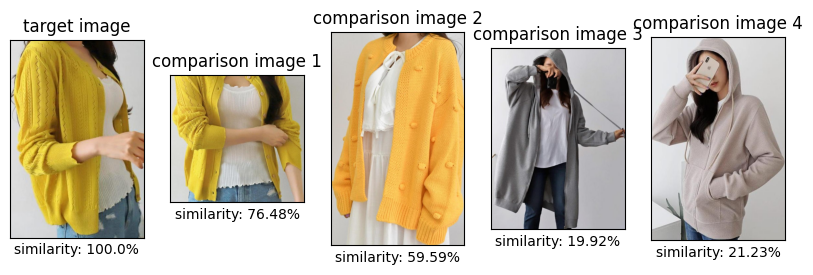
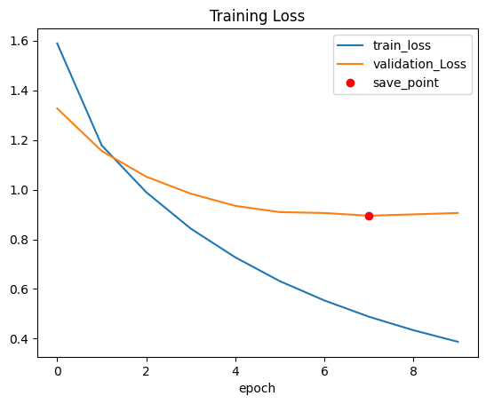

# CosinSimilarity_FinetuningModel   

## 소개   
MobileNetV2모델의 Feature Vector와 Cosine Similarity를 활용하여 두 옷 이미지의 유사도를 측정하는 모듈입니다.   

## 목적
교내에서 2022-11에 열리는 Capstone Design 공모전에서 개발하는 ["Find Cloth"](https://github.com/HYLogs/cloth_finder_socketServer) 프로젝트에서 이미지로 상품을 검색할 때 인공지능을 활용해서 유사도 순으로 검색해주기 위해서 개발되었습니다.   

## 개발 환경
- `CUDA`: 11.8
- `python`: 3.10.13
- `pytorch`: 2.1.0+cu118
- `matplotlib`: 3.7.1
- `numpy`: 1.24.1
- `Pillow`: 9.3.0

## 주요 내용
- [AI 허브 - K-Fashion 이미지](https://www.aihub.or.kr/aihubdata/data/view.do?currMenu=115&topMenu=100&aihubDataSe=data&dataSetSn=51)에서 제공한 옷 이미지 데이터셋 사용
- 제공하는 옷 이미지 데이터셋을 "옷 색상 - 옷 카테고리"으로 labeling 전처리
- 사전 학습된 MobileNetV2 전이 학습 (Accuracy: 77%)   
   

- 전이 학습된 MobileNetV2 모델 추론 시 특징 백터만 추출
- 이미지마다 추출한 특징 벡터를 Cosine Similarity로 계산해서 유사도 측정

## 보완할 점
- Data Unbalancing 문제로 모델의 학습률이 낮게 나왔을 수도 있습니다. 따라서 Class별 데이터 개수를 맞춰서 보완합니다.
- 224x224의 input size는 옷의 작은 특징들을 잘 표현하기 어려울 수 있습니다. 따라서 모델은 이미 GAP를 사용하기 때문에 이미지의 input size만 늘려서 보완합니다.